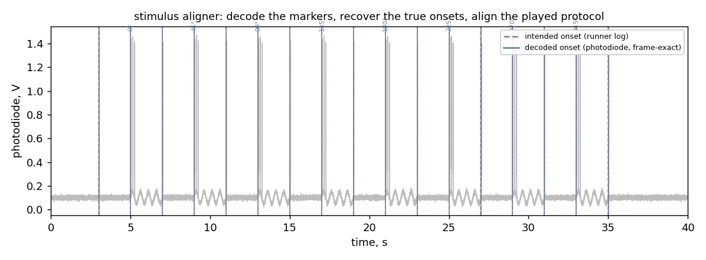

# stimulus-aligner

[](https://github.com/LynnYuSmith/stimulus-aligner/actions/workflows/tests.yml)

Decode a recording's photodiode **pulse markers** and align a played stimulus protocol onto
its **frame-exact** timeline.

The companion [stimulus-runner](https://github.com/LynnYuSmith/stimulus-runner) flashes a RED
corner marker at each block onset, pulse-coded by count (grey = 1, still = 2, moving = 3; a
black rest screen has none). On the rig a photodiode captures those pulses and a frame-clock
channel timestamps every imaging frame. This tool reads those two channels and recovers, for
each marker, **which block it was** (by pulse count) and **when it truly started** (the
photodiode onset mapped through the frame clock) — then aligns that onto the protocol the
runner wrote, attaching each block's label and orientation and reporting the intended-vs-true
timing offset.



## The idea

The runner's log records the *intended* (wall-clock) onset of each block, but there is
acquisition lag between "the browser drew the frame" and "the photodiode saw it." The
recording itself is the ground truth: the photodiode marker is when the stimulus *actually*
appeared, and the frame clock says which imaging frame that was.

Recovering it has real subtleties, each handled explicitly:

- **Flicker.** A photodiode marker is not a clean step — each logical pulse is a short burst
  of ~120 Hz monitor flicker, so one pulse crosses any threshold many times. The decoder maps
  every supra-threshold run onto the **known, fixed pulse period** (each run contributes the
  period slots it spans) and counts the distinct slots, so a pulse's own flicker collapses to
  one slot.
- **Acquisition lag.** Because the count keys on the stable period (not a width-dependent
  gap), a per-block timing lag doesn't change it.
- **Merged pulses.** If the photodiode never dips between two pulses (monitor persistence),
  they form one run with no interior edge — so the count is recovered from the run's
  *duration* (how many period slots it spans), not just its onsets.
- **Threshold.** It is derived from the signal — a low percentile for the baseline, a high
  percentile for the marker level, with the cut a fraction of the span up — so it scales with
  photodiode gain and clears the low-amplitude grating flicker, rather than assuming a fixed
  voltage.

One assumption remains, by necessity: the true pulse width must be under ~half the period.
At width ≈ period, a single wide flash is genuinely indistinguishable from two pulses by
threshold crossings alone.

## Use

```python
from aligner import decode_recording, align_to_protocol
import json

# frame_chan, pulse_chan: 1-D arrays from the recording; sr: sample rate (Hz)
events = decode_recording(frame_chan, pulse_chan, sr)
#   -> [{type, n_pulses, onset_s, onset_frame}, ...]  (grey/still/moving, in time order)

protocol = json.load(open("protocol_played.json"))     # written by the runner
result = align_to_protocol(events, protocol)           # tolerance_s / spread_s have real defaults
result["ok"]                 # every block matched, every type agreed, offset small AND constant
result["median_offset_s"]    # intended-vs-true timing offset
result["offset_spread_s"]    # how constant the offset is (a real alignment is nearly flat)
result["aligned"]            # per block: decoded onset_frame + label + orientation_deg
```

Reading a LabChart-style `.mat` (channels + sample rate) needs `scipy`; the core decode/align
works on plain NumPy arrays, so nothing but NumPy is required for the logic and tests.

## Run the example

```bash
python -m venv .venv && source .venv/bin/activate    # Python 3.10+
pip install numpy && pip install pytest matplotlib   # matplotlib only for the figure
python examples/demo.py        # writes figures/before_after.png
pytest
```

## What's here

- `aligner/decode.py` — frame-clock detection, pulse-burst counting (the flicker-grouping),
  and `decode_recording` → frame-exact events.
- `aligner/align.py` — `align_to_protocol`: positional match to the runner's played protocol,
  with labels, orientations, and the timing offset.
- `examples/make_sample.py` — a synthetic recording (frame clock + photodiode with realistic
  flicker markers, grating flicker to ignore, and a per-block acquisition lag). Ground truth
  known.
- `examples/demo.py` — decode + align the synthetic recording → `figures/before_after.png`.
- `tests/test_aligner.py` — `pytest` (7 checks): pulse counts, ignored grating flicker,
  frame mapping, full alignment, and that an unknown pulse count surfaces rather than vanishes.

## Verification

Fully tested headless on synthetic recordings (`pytest`, 15 checks). The suite covers the
hard cases, not just the clean one: merged pulses (persistence), acquisition lag, a weak
marker (auto-threshold), a bright block sitting in the baseline window, a NaN dropped sample
in the frame channel, a frame clock high at sample 0 (exact frame index, no off-by-one), and
the alignment gate rejecting a plausible-but-wrong positional match. A mis-generated pulse
count surfaces as `?N` rather than being silently dropped. On real recordings the photodiode
is the timing ground truth by design.

## License

MIT — see [LICENSE](LICENSE).
